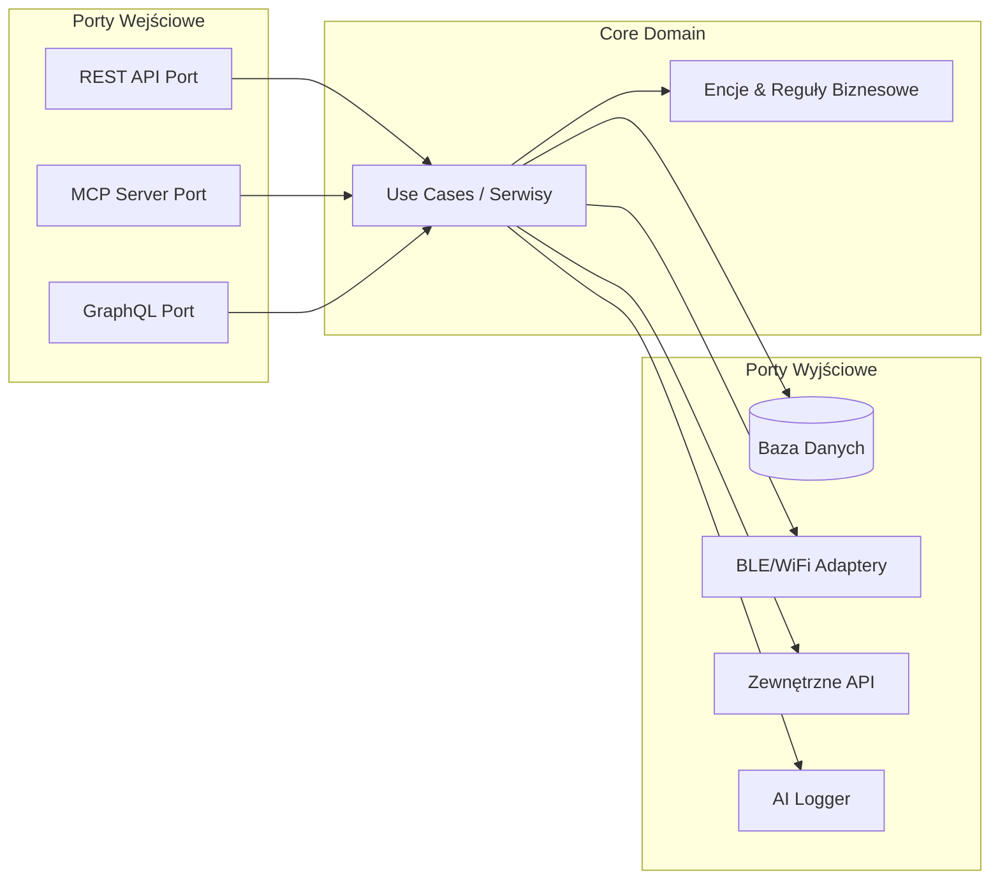
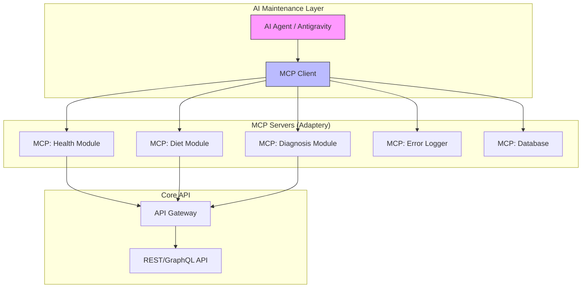
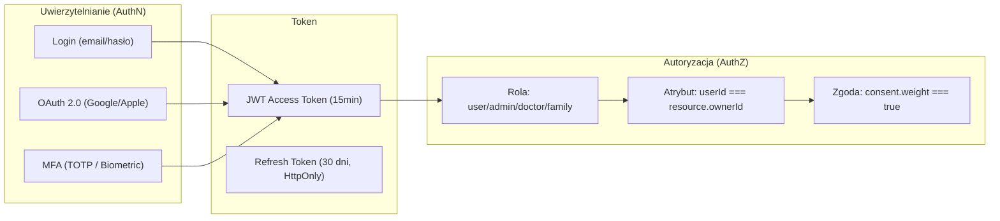
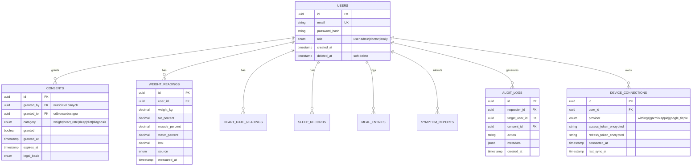

# 🏗️ Analiza Architektury: Aplikacja Zdrowotna

## Założenia Biznesowe (z researchu)
- **Platformy:** Przeglądarka (Web) + Aplikacje mobilne (iOS/Android)
- **Konserwacja:** Docelowo AI-driven via MCP Servers
- **Wymagania:** Szybkość, odporność na błędy, TDD, niezależna warstwa graficzna
- **Bezpieczeństwo:** Dane medyczne (HIPAA/GDPR), zgody na przechowywanie
- **Integracje:** Zegarki, wagi, pliki płaskie, API zewnętrzne
- **Logger:** Docelowo obsługiwany przez AI

---

## 1. Porównanie Architektur Backend

### 🔷 Opcja A: Hexagonal Architecture (Ports & Adapters) ⭐ REKOMENDACJA



| Aspekt | Ocena |
|--------|-------|
| **Niezależność warstw** | ⭐⭐⭐⭐⭐ — Core domain jest całkowicie odizolowany od frameworków |
| **Testowalność (TDD)** | ⭐⭐⭐⭐⭐ — Mockowanie portów jest trywialne |
| **MCP-ready** | ⭐⭐⭐⭐⭐ — MCP Server to po prostu kolejny adapter/port |
| **Niezależna grafika** | ⭐⭐⭐⭐⭐ — UI jest adapterem, wymienialnym bez dotykania logiki |
| **Szybkość startu** | ⭐⭐⭐ — Wymaga dyscypliny w definiowaniu portów |
| **Skalowalność** | ⭐⭐⭐⭐ — Można wyciągnąć moduły do mikroserwisów kiedy trzeba |

**✅ Zalety:**
- Idealnie pasuje do wymagania "niezależna grafika" — UI to adapter
- MCP Server to kolejny port wejściowy — plug & play
- TDD jest naturalne — testujemy core bez infrastruktury
- Łatwe dodawanie nowych integracji (wagi, zegarki) jako adapterów
- Przyszłościowa — można migrować do mikroserwisów moduł po module

**❌ Wady:**
- Wymaga więcej boilerplate'u na początku (interfejsy portów)
- Krzywa uczenia się wyższa niż prosty MVC
- Over-engineering dla prostych CRUD-ów

---

### 🔶 Opcja B: Modular Monolith

| Aspekt | Ocena |
|--------|-------|
| **Niezależność warstw** | ⭐⭐⭐⭐ — Zależy od dyscypliny |
| **Testowalność (TDD)** | ⭐⭐⭐⭐ — Dobra, ale bez formalnych portów trudniej mockować |
| **MCP-ready** | ⭐⭐⭐ — Wymaga dodatkowej warstwy integracyjnej |
| **Szybkość startu** | ⭐⭐⭐⭐⭐ — Najszybszy start, jeden deployment |
| **Skalowalność** | ⭐⭐⭐ — Skalowanie tylko jako całość (lub refaktor do mikro) |

**✅ Zalety:**
- 7x tańszy niż mikroserwisy wg badań (Instagram, Shopify nadal monolity)
- Najprostsza infrastruktura — jedno CI/CD, jedna baza
- Deweloperzy dostarczają 2.5x więcej feature'ów

**❌ Wady:**
- Granice modułów mogą się rozmyć bez dyscypliny
- Trudniejsze niezależne skalowanie modułów
- MCP wymaga dodatkowej warstwy proxy

---

### 🔴 Opcja C: Microservices

| Aspekt | Ocena |
|--------|-------|
| **Niezależność warstw** | ⭐⭐⭐⭐⭐ — Fizyczna izolacja |
| **Testowalność (TDD)** | ⭐⭐⭐ — Unit testy łatwe, integration/E2E trudne |
| **MCP-ready** | ⭐⭐⭐⭐ — Każdy serwis = potencjalny MCP server |
| **Skalowalność** | ⭐⭐⭐⭐⭐ — Granularna |
| **Szybkość startu** | ⭐ — Ogromny koszt początkowy (service mesh, observability) |

**✅ Zalety:**
- Niezależne deployowanie i skalowanie
- Idealna izolacja błędów (fault-tolerant)

**❌ Wady:**
- Ogromny koszt infrastruktury (Kubernetes, Service Mesh, Observability)
- 19/50 największych awarii w tech spowodowane kaskadowymi błędami w mikroserwisach
- Za wcześnie na tym etapie projektu

---

## 2. ⭐ REKOMENDACJA: Hexagonal Modular Monolith (Hybrid)

Łączymy **siłę Hexagonal Architecture z pragmatyzmem Modular Monolith**:

```
┌──────────────────────────────────────────────────────┐
│              DEPLOYMENT: Jeden Serwer                │
│                                                      │
│  ┌─────────────┐  ┌──────────────┐  ┌──────────────┐│
│  │  Moduł:     │  │  Moduł:      │  │  Moduł:      ││
│  │  HEALTH     │  │  DIET         │  │  DIAGNOSIS   ││
│  │  (Hex Arch) │  │  (Hex Arch)  │  │  (Hex Arch)  ││
│  │             │  │              │  │              ││
│  │ ┌─────────┐ │  │ ┌──────────┐ │  │ ┌──────────┐ ││
│  │ │  Core   │ │  │ │  Core    │ │  │ │  Core    │ ││
│  │ │ Domain  │ │  │ │ Domain   │ │  │ │ Domain   │ ││
│  │ └────┬────┘ │  │ └────┬─────┘ │  │ └────┬─────┘ ││
│  │ Ports│In/Out│  │ Ports│In/Out │  │ Ports│In/Out ││
│  └──────┼──────┘  └──────┼───────┘  └──────┼───────┘│
│         │                │                 │        │
│  ┌──────┴────────────────┴─────────────────┴───────┐│
│  │          Shared: API Gateway + MCP Layer         ││
│  └──────────────────────────────────────────────────┘│
└──────────────────────────────────────────────────────┘
```

**Kiedy rosniesz → wyciągasz moduł do mikroserwisu bez przepisywania core'a.**

---

## 3. Warstwa Graficzna (Frontend) — Analiza

### Po co niezależność?
Aby móc:
- Zmienić design system bez dotykania logiki
- Tworzyć różne "skórki" (tematyczne)
- Przełączać się między React/Vue/Svelte bez wpływu na backend

### Rekomendacja: **Next.js (Web) + React Native (Mobile) + Shared Design Tokens**

| Wariant | Web | Mobile | Shared Code | Ocena |
|---------|-----|--------|-------------|-------|
| **Next.js + React Native** | ✅ SSR/SSG, SEO | ✅ Native feel | ⭐⭐⭐⭐ (hooks, logika) | ⭐⭐⭐⭐⭐ |
| Flutter | ❌ Web słaby | ✅ Świetny | ⭐⭐⭐⭐⭐ (jeden kod) | ⭐⭐⭐ |
| PWA only | ✅ | ⚠️ Ograniczony (BLE!) | ⭐⭐⭐⭐⭐ | ⭐⭐ |

> **Kluczowy powód:** Web PWA **nie ma dostępu do BLE** na iOS, więc potrzebujemy natywnych aplikacji dla integracji z zegarkami i wagami. Next.js + React Native daje najlepszą równowagę.

### Architektura UI (niezależna od backendu):

```
┌──────────────────────────────────────────────┐
│             DESIGN TOKEN SYSTEM              │
│  (kolory, fonty, spacing, animacje)          │
│  → JSON/TS config → importowany wszędzie     │
├──────────────┬───────────────────────────────┤
│   WEB UI     │       MOBILE UI               │
│  (Next.js)   │    (React Native)             │
│              │                               │
│  Components  │    Components                 │
│  ↓           │    ↓                          │
│  Manipulator │    Manipulator                │
│  Layer       │    Layer                      │
│  (hooks,     │    (hooks,                    │
│   state)     │     state)                    │
├──────────────┴───────────────────────────────┤
│           API CLIENT (shared)                │
│     REST + WebSocket + MCP Client            │
└──────────────────────────────────────────────┘
```

---

## 4. MCP + API: Hybrydowe Podejście (API-Centric MCP)



**Strategia:**
1. **REST API** jest głównym interfejsem (stabilne, przewidywalne)
2. **MCP Servers** opakowują REST API, dając AI elastyczny dostęp
3. AI agent zarządza modułami, logami i deploymentem via MCP
4. **Nie rezygnujemy z API** — MCP je wzbogaca, nie zastępuje

---

## 5. Bezpieczeństwo Danych Medycznych

| Wymóg | Rozwiązanie |
|-------|-------------|
| **RODO/GDPR** | Szyfrowanie AES-256 at rest, TLS 1.3 in transit |
| **HIPAA 2026** | Szyfrowanie teraz **obowiązkowe** (nie "addressable") |
| **Zgody** | Consent Management System — granularne zgody per kategoria danych |
| **Audit trail** | Immutable log każdego dostępu do danych medycznych |
| **Data residency** | Dane EU przechowywane w EU (np. AWS eu-central-1) |
| **Right to erasure** | Soft-delete z fizycznym usunięciem po 30 dniach |
| **MCP Security** | OAuth 2.0 + Resource Indicators + User Consent per-action |

---

## 6. TDD & Error Logging w Architekturze

### TDD wpisane w założenia:
```
src/
├── modules/
│   ├── health/
│   │   ├── domain/           # Pure business logic
│   │   │   ├── entities/
│   │   │   ├── use-cases/
│   │   │   └── __tests__/    # Unit tests (TDD: piszemy NAJPIERW)
│   │   ├── ports/            # Interfejsy (kontrakty)
│   │   │   ├── in/           # API wejściowe
│   │   │   └── out/          # Repozytoria, zewnętrzne serwisy
│   │   ├── adapters/         # Implementacje portów
│   │   │   ├── rest/
│   │   │   ├── mcp/
│   │   │   ├── ble/
│   │   │   └── __tests__/    # Integration tests
│   │   └── __e2e__/          # End-to-end tests
```

### AI Error Logger:
```
Error → Structured Log (JSON) → MCP Server → AI Agent Analysis
                                              ↓
                                   Auto-categorize severity
                                   Suggest fix / create ticket
                                   Pattern detection (recurring issues)
```

---

## 7. Integracja Urządzeń (Adaptery)

| Urządzenie | Protokół | Adapter |
|------------|----------|---------|
| Apple Watch | HealthKit API | `AppleHealthAdapter` |
| Garmin | Garmin Connect API (OAuth) | `GarminAdapter` |
| Withings Scale | Withings API (OAuth) | `WithingsAdapter` |
| Generic BLE Scale | Bluetooth Low Energy | `BLEScaleAdapter` |
| Pliki CSV/JSON | File import | `FlatFileAdapter` |
| Google Fit | Health Connect API | `GoogleFitAdapter` |

> Każdy adapter implementuje ten sam **Port** — zmiana urządzenia = zmiana adaptera, **zero zmian w logice biznesowej**.

---

## 8. Walidacja Danych — Zod Schemas

Zod waliduje dane **na granicy systemu** (porty wejściowe/wyjściowe). Core domain operuje na typach TypeScript, które Zod gwarantuje.

### Schemat warstw walidacji:
```
Żądanie HTTP → Zod Schema (walidacja) → DTO → Use Case (core) → Entity
                 ↑ ODRZUĆ jeśli błąd        ↑ Czyste typy TS
```

### Kluczowe schematy per moduł:

```typescript
// ══════════════════════════════════════════
// SHARED / AUTH
// ══════════════════════════════════════════
import { z } from 'zod';

export const UserSchema = z.object({
  id: z.string().uuid(),
  email: z.string().email(),
  role: z.enum(['user', 'admin', 'doctor', 'family_member']),
  createdAt: z.date(),
});

export const ConsentSchema = z.object({
  userId: z.string().uuid(),
  category: z.enum(['weight', 'heart_rate', 'sleep', 'diet', 'diagnosis', 'location']),
  granted: z.boolean(),
  grantedAt: z.date(),
  expiresAt: z.date().optional(),
  legalBasis: z.enum(['explicit_consent', 'vital_interest', 'legitimate_interest']),
});

// ══════════════════════════════════════════
// MODUŁ: HEALTH (waga, pomiary ciała)
// ══════════════════════════════════════════
export const WeightReadingSchema = z.object({
  userId: z.string().uuid(),
  weightKg: z.number().min(0.5).max(500),
  fatPercent: z.number().min(0).max(100).optional(),
  musclePercent: z.number().min(0).max(100).optional(),
  waterPercent: z.number().min(0).max(100).optional(),
  bmi: z.number().min(5).max(100).optional(),
  source: z.enum(['withings', 'garmin', 'ble_scale', 'manual', 'csv_import']),
  measuredAt: z.date(),
});

export const HeartRateSchema = z.object({
  userId: z.string().uuid(),
  bpm: z.number().int().min(20).max(300),
  type: z.enum(['resting', 'active', 'sleep', 'recovery']),
  source: z.enum(['apple_watch', 'garmin', 'manual']),
  measuredAt: z.date(),
});

export const SleepRecordSchema = z.object({
  userId: z.string().uuid(),
  startedAt: z.date(),
  endedAt: z.date(),
  deepMinutes: z.number().int().min(0),
  lightMinutes: z.number().int().min(0),
  remMinutes: z.number().int().min(0),
  awakeMinutes: z.number().int().min(0),
  score: z.number().min(0).max(100).optional(),
  source: z.enum(['apple_watch', 'garmin', 'withings_mat', 'manual']),
});

// ══════════════════════════════════════════
// MODUŁ: DIET (kalorie, makroskładniki)
// ══════════════════════════════════════════
export const MealEntrySchema = z.object({
  userId: z.string().uuid(),
  mealType: z.enum(['breakfast', 'lunch', 'dinner', 'snack']),
  items: z.array(z.object({
    name: z.string().min(1).max(200),
    calories: z.number().min(0),
    proteinG: z.number().min(0),
    carbsG: z.number().min(0),
    fatG: z.number().min(0),
    fiberG: z.number().min(0).optional(),
    barcode: z.string().optional(),
  })).min(1),
  loggedAt: z.date(),
});

// ══════════════════════════════════════════
// MODUŁ: DIAGNOSIS (objawy, ocena AI)
// ══════════════════════════════════════════
export const SymptomReportSchema = z.object({
  userId: z.string().uuid(),
  symptoms: z.array(z.object({
    name: z.string().min(2),
    bodyArea: z.enum(['head', 'chest', 'abdomen', 'limbs', 'back', 'skin', 'general']),
    severity: z.number().int().min(1).max(10),
    durationDays: z.number().min(0),
  })).min(1),
  additionalNotes: z.string().max(2000).optional(),
  reportedAt: z.date(),
});
```

### Zasady walidacji:
- **Port wejściowy (REST/MCP):** `Schema.parse(input)` — odrzuca nieprawidłowe dane z czytelnym błędem
- **Port wyjściowy (DB→Core):** `Schema.safeParse(dbRow)` — loguje ostrzeżenie jeśli dane w bazie są uszkodzone
- **Zod generuje typy TS:** `type WeightReading = z.infer<typeof WeightReadingSchema>` — single source of truth

---

## 9. Strategia Testów per Moduł

### Matryca testów:

| Typ testu | Co testuje | Narzędzie | Kiedy się uruchamia | Pokrycie |
|-----------|-----------|-----------|---------------------|----------|
| **Unit** | Core domain (use cases, entities) | Vitest | Na każdy commit (pre-commit hook) | ≥90% core |
| **Integration** | Adaptery (DB, API, BLE) | Vitest + Testcontainers | Na push do brancha | ≥80% adapterów |
| **Contract** | Porty (czy adapter spełnia interfejs) | Vitest | Na push do brancha | 100% portów |
| **E2E** | Pełne flow użytkownika (web/mobile) | Playwright / Detox | Przed merge do main | Krytyczne ścieżki |
| **Security** | Izolacja danych, auth bypass | Vitest + custom | Nightly + przed release | OWASP Top 10 |

### Testy per moduł:

```
modules/health/
├── domain/__tests__/
│   ├── calculate-bmi.unit.test.ts          ← TDD: pisane PRZED kodem
│   ├── analyze-weight-trend.unit.test.ts
│   └── detect-anomaly.unit.test.ts
├── adapters/__tests__/
│   ├── withings-adapter.integration.test.ts  ← Mockowany API
│   ├── ble-scale-adapter.integration.test.ts
│   ├── postgres-repo.integration.test.ts     ← Testcontainers (prawdziwe PG)
│   └── weight-port.contract.test.ts          ← Sprawdza kontrakt portu
└── __e2e__/
    ├── add-weight-reading.e2e.test.ts        ← Pełny flow: login → dodaj wagę → sprawdź dashboard
    └── export-health-report.e2e.test.ts

modules/diet/
├── domain/__tests__/
│   ├── calculate-macros.unit.test.ts
│   ├── meal-plan-generator.unit.test.ts
│   └── nutrient-deficit-alert.unit.test.ts
├── adapters/__tests__/
│   ├── barcode-scanner.integration.test.ts
│   └── food-db-adapter.integration.test.ts
└── __e2e__/
    └── log-meal-flow.e2e.test.ts

modules/diagnosis/
├── domain/__tests__/
│   ├── symptom-triage.unit.test.ts
│   ├── risk-assessment.unit.test.ts
│   └── condition-matching.unit.test.ts
├── adapters/__tests__/
│   └── ai-diagnosis-adapter.integration.test.ts
└── __e2e__/
    └── symptom-report-to-pdf.e2e.test.ts
```

### Reguła TDD w projekcie:
```
 RED:   Napisz test, który FAILUJE
 GREEN: Napisz MINIMUM kodu, żeby test przeszedł
 REFACTOR: Popraw kod, testy nadal zielone
 ↻ Powtórz
```

> **CI blokuje merge jeśli:** pokrycie core < 90%, pokrycie adapterów < 80%, jakikolwiek test E2E FAIL.

---

## 10. Autoryzacja i Uwierzytelnianie

### Model: JWT + RBAC + ABAC



### Role i uprawnienia:

| Rola | Health (odczyt) | Health (zapis) | Diet | Diagnosis | Admin panel | Dane innego usera |
|------|-----------------|----------------|------|-----------|-------------|-------------------|
| **user** | ✅ Swoje | ✅ Swoje | ✅ Swoje | ✅ Swoje | ❌ | ❌ NIGDY |
| **family_member** | ✅ Jeśli zgoda | ❌ | ❌ | ❌ | ❌ | ✅ Tylko z consent |
| **doctor** | ✅ Jeśli zgoda | ❌ | ✅ Jeśli zgoda | ✅ Jeśli zgoda | ❌ | ✅ Tylko z consent |
| **admin** | ✅ Anonimowe | ❌ | ✅ Anonimowe | ❌ | ✅ | ⚠️ Tylko zagregowane |

### Consent Management (Zarządzanie zgodami):

```typescript
// Każda operacja na danych medycznych MUSI przejść przez ConsentGuard:

async function getWeightHistory(requesterId: string, targetUserId: string) {
  // 1. Czy requester to właściciel danych?
  if (requesterId === targetUserId) return proceed();

  // 2. Czy jest aktywna zgoda?
  const consent = await consentRepo.findActive({
    grantedTo: requesterId,
    grantedBy: targetUserId,
    category: 'weight',
  });
  if (!consent) throw new ForbiddenError('Brak zgody na dostęp do danych wagi');

  // 3. Czy zgoda nie wygasła?
  if (consent.expiresAt && consent.expiresAt < new Date()) {
    throw new ForbiddenError('Zgoda wygasła');
  }

  // 4. Audit log
  await auditLog.record({
    action: 'READ_WEIGHT',
    requesterId,
    targetUserId,
    consentId: consent.id,
    timestamp: new Date(),
  });

  return proceed();
}
```

---

## 11. Izolacja Danych Użytkowników

### Problem:
> Użytkownik A **NIGDY** nie może zobaczyć danych użytkownika B, nawet przez błąd w kodzie.

### Strategia: PostgreSQL Row-Level Security (RLS) + Application Layer

**Warstwa 1 — Aplikacja (NestJS Guard):**
```typescript
// Każde zapytanie automatycznie filtruje po userId z JWT
@Injectable()
export class TenantGuard implements CanActivate {
  canActivate(context: ExecutionContext): boolean {
    const request = context.switchToHttp().getRequest();
    const userId = request.user.sub; // z JWT
    // Wstrzyknij userId do każdego zapytania DB
    request.tenantId = userId;
    return true;
  }
}
```

**Warstwa 2 — Baza danych (PostgreSQL RLS) — ostatnia linia obrony:**
```sql
-- Włączenie RLS na tabelach z danymi medycznymi
ALTER TABLE weight_readings ENABLE ROW LEVEL SECURITY;
ALTER TABLE heart_rate_readings ENABLE ROW LEVEL SECURITY;
ALTER TABLE sleep_records ENABLE ROW LEVEL SECURITY;
ALTER TABLE meal_entries ENABLE ROW LEVEL SECURITY;
ALTER TABLE symptom_reports ENABLE ROW LEVEL SECURITY;

-- Polityka: użytkownik widzi TYLKO swoje dane
CREATE POLICY user_isolation ON weight_readings
  USING (user_id = current_setting('app.current_user_id')::uuid);

CREATE POLICY user_isolation ON heart_rate_readings
  USING (user_id = current_setting('app.current_user_id')::uuid);

-- Polityka: doctor/family widzi dane po consent
CREATE POLICY consent_access ON weight_readings
  FOR SELECT
  USING (
    EXISTS (
      SELECT 1 FROM consents
      WHERE consents.granted_to = current_setting('app.current_user_id')::uuid
        AND consents.granted_by = weight_readings.user_id
        AND consents.category = 'weight'
        AND consents.granted = true
        AND (consents.expires_at IS NULL OR consents.expires_at > NOW())
    )
  );
```

**Warstwa 3 — Adapter (Repository):**
```typescript
// Każdy adapter DB ustawia kontekst użytkownika PRZED zapytaniem
async findWeightHistory(userId: string, days: number) {
  await this.db.query(`SET LOCAL app.current_user_id = '${userId}'`);
  // RLS automatycznie filtruje — nawet jeśli ktoś zapomni WHERE
  return this.db.query('SELECT * FROM weight_readings ORDER BY measured_at DESC');
}
```

### Diagram izolacji:
```
┌──────────────────────────────────────────────────────────────┐
│ WARSTWA 1: JWT Guard (NestJS)                                │
│ → Wyciąga userId z tokenu, odrzuca brak tokenu               │
├──────────────────────────────────────────────────────────────┤
│ WARSTWA 2: ConsentGuard (Application)                        │
│ → Sprawdza, czy requester ma prawo do danych targetUser      │
├──────────────────────────────────────────────────────────────┤
│ WARSTWA 3: Repository (Adapter)                              │
│ → SET LOCAL app.current_user_id = userId                     │
├──────────────────────────────────────────────────────────────┤
│ WARSTWA 4: PostgreSQL RLS (Database)          ← LAST RESORT  │
│ → Nawet jeśli kod ma buga, baza NIE zwróci cudzych danych    │
└──────────────────────────────────────────────────────────────┘
```

> **Zasada:** Nawet gdyby warstwa aplikacji miała bug, **PostgreSQL RLS gwarantuje**, że zapytanie fizycznie nie może zwrócić danych innego użytkownika.

---

## 12. Schemat Bazy Danych (główne tabele)



---

## 13. Czego Brakuje? (Gap Analysis — zaktualizowane)

| Element | Status | Priorytet |
|---------|--------|-----------|
| ~~Walidacja danych (Zod)~~ | ✅ Zdefiniowane (§8) | — |
| ~~Testy per moduł~~ | ✅ Zdefiniowane (§9) | — |
| ~~Autoryzacja & AuthN~~ | ✅ Zdefiniowane (§10) | — |
| ~~Izolacja danych~~ | ✅ Zdefiniowane (§11) | — |
| ~~Schemat bazy danych~~ | ✅ Zdefiniowane (§12) | — |
| ~~OCR dokumentów medycznych~~ | ✅ Zdefiniowane (detailed_plan.md §5) | — |
| ~~Wizualizacja danych~~ | ✅ Zdefiniowane (detailed_plan.md §6) | — |
| **Offline-first strategy** | ❌ Nie zdefiniowane | WYSOKI — użytkownicy mobilni |
| **Real-time sync (WebSocket)** | ❌ Nie zdefiniowane | ŚREDNI — live dashboard |
| **Notification service** | ❌ Nie zdefiniowane | ŚREDNI — przypomnienia |
| **Rate limiting & throttling** | ❌ Nie zdefiniowane | ŚREDNI — ochrona API |
| **CI/CD pipeline** | ❌ Nie zdefiniowane | WYSOKI — automatyzacja |
| **Feature flags** | ❌ Nie zdefiniowane | NISKI — A/B testing |
| **Internationalization (i18n)** | ❌ Nie zdefiniowane | NISKI — wielojęzyczność |
| **Analytics / Telemetria** | ❌ Nie zdefiniowane | ŚREDNI — zrozumienie użytkowników |

---

## 14. Proponowany Stack Technologiczny

| Warstwa | Technologia | Powód |
|---------|-------------|-------|
| **Backend** | Node.js + TypeScript | Ekosystem MCP, typing, async, TDD-friendly |
| **Framework** | NestJS | Modularny, dependency injection, idealny dla Hex Arch |
| **Walidacja** | Zod | Runtime validation + type inference, lżejszy od class-validator |
| **Baza danych** | PostgreSQL + TimescaleDB | Dane relacyjne + time-series (tętno, kroki) + RLS |
| **ORM** | Drizzle ORM | Type-safe, Zod integration, SQL-first |
| **Cache** | Redis | Sesje, rate limiting, real-time |
| **Auth** | JWT (jose) + bcrypt + OAuth2 | Standardowy, MCP-compatible |
| **Web Frontend** | Next.js 15 (React) | SSR, SEO, App Router |
| **Mobile** | React Native (Expo) | Shared hooks/logika z web, natywne BLE |
| **API** | REST + GraphQL (opcja) | Stabilne + elastyczne zapytania |
| **Wykresy (Web)** | Recharts | React-native, responsive, animacje |
| **Wykresy (Mobile)** | Victory Native | React Native kompatybilny |
| **OCR** | Tesseract.js + OpenRouter LLM | Lokalne OCR + AI interpretacja |
| **MCP** | Custom MCP Servers (TS) | AI maintenance, error logging |
| **Testy** | Vitest + Playwright + Testcontainers | Unit/Integration/Contract + E2E |
| **CI/CD** | GitHub Actions | Automatyzacja, łatwa konfiguracja |
| **Deploy** | Docker + Railway/Fly.io | Szybki start, skalowalne |
