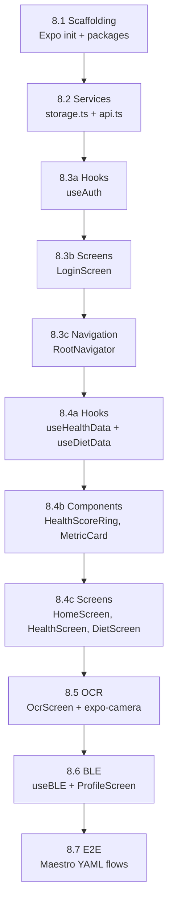

# Etap 8: Frontend Mobile (React Native) — Szczegółowy Plan + TDD

> **Kontekst:** Plan do realizacji przez "drugiego/słabszego AI" — każdy krok jest atomowy, weryfikowalny i zawiera dokładne instrukcje TDD.

---

## Analiza Stanu Projektu

Przed rozpoczęciem implementacji przeanalizowano:

| Zasób | Stan | Kluczowe wnioski |
|-------|------|-----------------|
| [detailed_plan.md](file:///c:/od_zera_do_ai/Zdrowie_v1/zdrowiev1/docs/detailed_plan.md) | Etap 8 zaplanowany (8.1–8.4) | 5 ekranów + BLE + Maestro E2E |
| [api-client](file:///c:/od_zera_do_ai/Zdrowie_v1/zdrowiev1/packages/api-client/src/index.ts) | Używa `localStorage` | ⚠️ Wymaga adaptera `AsyncStorage` dla RN |
| [design-tokens](file:///c:/od_zera_do_ai/Zdrowie_v1/zdrowiev1/packages/design-tokens/src/index.ts) | Wartości CSS `rem` | ⚠️ RN wymaga wartości numerycznych (px) |
| [zod-schemas](file:///c:/od_zera_do_ai/Zdrowie_v1/zdrowiev1/packages/zod-schemas/src/index.ts) | 12 schematów gotowych | ✅ Reusable bez zmian |
| [shared-types](file:///c:/od_zera_do_ai/Zdrowie_v1/zdrowiev1/packages/shared-types/src/index.ts) | 8 typów TS | ✅ Reusable bez zmian |
| [stack_versions.md](file:///c:/od_zera_do_ai/Zdrowie_v1/zdrowiev1/docs/stack_versions.md) | Expo v52.x | ✅ Zablokowana wersja |

---

## Zatwierdzone Decyzje ✅

| # | Decyzja | Wybór | Uzasadnienie |
|---|---------|-------|--------------|
| 1 | **Expo vs bare RN** | ✅ **Expo SDK 52** (managed + dev-client) | Łatwiejszy setup, OTA updates, BLE via `expo-dev-client` |
| 2 | **E2E Framework** | ✅ **Maestro** (zamiast Detox) | YAML-based, prostsze dla AI, wizualny debugger Maestro Studio |
| 3 | **Emulator** | ✅ **Android Studio Emulator** | Wymaga instalacji — instrukcja poniżej |

---

## Prereq: Instalacja Android Emulatora (Windows)

> [!IMPORTANT]
> **Przed rozpoczęciem Etapu 8 musisz zainstalować emulator Android.** Jest to WYMAGANE do uruchomienia Expo i testów Maestro.

### Krok 1: Android Studio
1. Pobierz [Android Studio](https://developer.android.com/studio) i zainstaluj
2. Podczas instalacji zaznacz: **Android SDK**, **Android SDK Platform**, **Android Virtual Device**
3. Po instalacji otwórz Android Studio → **More Actions** → **Virtual Device Manager**
4. Kliknij **Create Virtual Device** → wybierz **Pixel 8** → pobierz obraz systemu **API 34** → **Finish**
5. Kliknij ▶️ Play aby uruchomić emulator

### Krok 2: Zmienne środowiskowe (PowerShell)
```powershell
# Dodaj do $PROFILE lub ustaw ręcznie:
$env:ANDROID_HOME = "$env:LOCALAPPDATA\Android\Sdk"
$env:PATH += ";$env:ANDROID_HOME\emulator;$env:ANDROID_HOME\platform-tools"

# Weryfikacja:
adb devices  # powinno pokazać emulator
```

### Krok 3: Maestro Studio
1. Pobierz [MaestroStudio.exe](https://studio.maestro.dev/MaestroStudio.exe)
2. Zainstaluj (double-click → wizard)
3. Otwórz Maestro Studio → połącz z emulator → gotowe

### Krok 4: Weryfikacja
```powershell
# Emulator działa:
adb devices
# Maestro widzi urządzenie:
# Otwórz Maestro Studio → kliknij "No device connected" → wybierz emulator
```

---

## Architektura Mobile App

```
apps/mobile/
├── app.json                        ← Expo config
├── package.json
├── tsconfig.json                   ← extends tsconfig.base.json
├── babel.config.js
├── metro.config.js
│
├── src/
│   ├── navigation/
│   │   ├── RootNavigator.tsx       ← Auth gate + Tab navigator
│   │   ├── TabNavigator.tsx        ← Bottom tabs (Home/Health/Diet/OCR/Profile)
│   │   └── __tests__/
│   │       └── navigation.test.tsx
│   │
│   ├── screens/
│   │   ├── HomeScreen.tsx          ← Mini dashboard, Activity Rings, Health Score
│   │   ├── HealthScreen.tsx        ← Weight, Heart, Sleep cards + sparklines
│   │   ├── DietScreen.tsx          ← Quick meal log, barcode scanner
│   │   ├── OcrScreen.tsx           ← Camera scan + gallery upload
│   │   ├── ProfileScreen.tsx       ← Settings, devices, consents
│   │   ├── LoginScreen.tsx         ← Email/password login
│   │   └── __tests__/
│   │       ├── HomeScreen.test.tsx
│   │       ├── HealthScreen.test.tsx
│   │       ├── DietScreen.test.tsx
│   │       ├── OcrScreen.test.tsx
│   │       ├── ProfileScreen.test.tsx
│   │       └── LoginScreen.test.tsx
│   │
│   ├── components/
│   │   ├── HealthScoreRing.tsx     ← Animated SVG ring 0-100
│   │   ├── ActivityRings.tsx       ← 3 rings: Move/Exercise/Stand
│   │   ├── SparklineChart.tsx      ← Mini chart for cards
│   │   ├── MetricCard.tsx          ← Reusable card with icon, value, trend
│   │   ├── BarcodeScanner.tsx      ← Camera-based barcode reader
│   │   ├── NotificationBell.tsx    ← Badge counter
│   │   └── __tests__/
│   │       ├── HealthScoreRing.test.tsx
│   │       ├── MetricCard.test.tsx
│   │       └── SparklineChart.test.tsx
│   │
│   ├── hooks/
│   │   ├── useAuth.ts              ← Login/logout/session management
│   │   ├── useHealthData.ts        ← Fetch weight, heart, sleep, activity
│   │   ├── useDietData.ts          ← Fetch/log meals, barcode lookup
│   │   ├── useBLE.ts               ← BLE scanning, pairing, weight reading
│   │   ├── useNotifications.ts     ← Push + in-app notifications
│   │   └── __tests__/
│   │       ├── useAuth.test.ts
│   │       ├── useHealthData.test.ts
│   │       ├── useDietData.test.ts
│   │       └── useBLE.test.ts
│   │
│   ├── services/
│   │   ├── storage.ts              ← AsyncStorage adapter (token persistence)
│   │   ├── api.ts                  ← Mobile-adapted API client
│   │   └── __tests__/
│   │       ├── storage.test.ts
│   │       └── api.test.ts
│   │
│   ├── theme/
│   │   ├── index.ts                ← RN-adapted design tokens
│   │   └── __tests__/
│   │       └── theme.test.ts
│   │
│   └── types/
│       └── index.ts                ← Re-export from @monorepo/shared-types
│
├── __e2e__/
│   ├── login.yaml                  ← Maestro E2E flow
│   ├── dashboard.yaml
│   ├── log-meal.yaml
│   ├── navigation.yaml
│   └── config.yaml                 ← Maestro workspace config
```

---

## Proposed Changes

### Component 1: Scaffolding & Configuration

#### [NEW] apps/mobile/package.json
Expo SDK 52 z dependencies: `expo`, `expo-router` (opcja) lub `@react-navigation/native`, `@react-navigation/bottom-tabs`, `@react-navigation/native-stack`, `react-native-ble-plx`, `expo-camera`, `expo-barcode-scanner`, `@react-native-async-storage/async-storage`, `react-native-svg`, `react-native-reanimated`.

Dev deps: `jest`, `@testing-library/react-native`, `@testing-library/jest-native`.

> Maestro nie wymaga dependency w `package.json` — jest zainstalowany osobno jako Maestro Studio.

#### [NEW] apps/mobile/tsconfig.json
Extends `../../tsconfig.base.json`, dodaje paths: `@/` → `./src/`.

#### [NEW] apps/mobile/app.json
Expo config z `name: "Zdrowie"`, `slug: "zdrowie"`, `scheme: "zdrowie"`.

---

### Component 2: Adaptacja Pakietów Shared

#### [MODIFY] [api-client/src/index.ts](file:///c:/od_zera_do_ai/Zdrowie_v1/zdrowiev1/packages/api-client/src/index.ts)
Dodanie opcjonalnego token providera zamiast hardcoded `localStorage`:

```diff
-const token = typeof window !== 'undefined' ? localStorage.getItem('auth_token') : null;
+const token = await config?.tokenProvider?.();
```

Albo lepiej — **bez modyfikacji** istniejącego pakietu:

#### [NEW] apps/mobile/src/services/api.ts
Nowy klient HTTP specyficzny dla mobile, który wrapuje `axios` i pobiera token z `AsyncStorage` zamiast `localStorage`.

#### [NEW] apps/mobile/src/services/storage.ts
Wrapper na `@react-native-async-storage/async-storage` z metodami: `getToken()`, `setToken()`, `removeToken()`, `getItem()`, `setItem()`.

#### [NEW] apps/mobile/src/theme/index.ts
Konwersja design tokens z CSS `rem` → RN numeryczne wartości:

```typescript
// CSS: '0.25rem' → RN: 4 (assuming 1rem = 16px)
export const theme = {
  colors: { ...designTokens.colors },
  spacing: { xs: 4, sm: 8, md: 16, lg: 32 },
  typography: {
    fontFamily: 'Inter',
    fontSize: { sm: 14, base: 16, lg: 18, xl: 20 },
  },
};
```

---

### Component 3: Navigation

#### [NEW] apps/mobile/src/navigation/RootNavigator.tsx
Auth gate: jeśli `useAuth().isAuthenticated` → `TabNavigator`, else → `LoginScreen`.

#### [NEW] apps/mobile/src/navigation/TabNavigator.tsx
5 zakładek: Home (🏠), Health (❤️), Diet (🍎), OCR (📷), Profile (👤).

---

### Component 4: Hooks (Logyka biznesowa)

#### [NEW] apps/mobile/src/hooks/useAuth.ts
- `login(email, password)` → POST `/auth/login` → zapisz token w AsyncStorage
- `logout()` → usuń token z AsyncStorage
- `restoreSession()` → sprawdź czy token istnieje → auto-login
- Stan: `{ isAuthenticated, isLoading, user, error }`

#### [NEW] apps/mobile/src/hooks/useHealthData.ts
- `fetchWeightHistory(days)` → GET `/health/weight?days=30`
- `fetchHealthScore()` → GET `/dashboard/summary`
- `fetchAnomalies()` → GET `/dashboard/anomalies`
- Stan: `{ data, isLoading, error, refetch }`

#### [NEW] apps/mobile/src/hooks/useDietData.ts
- `fetchMeals(date)` → GET `/diet/meals?date=...`
- `logMeal(meal)` → POST `/diet/meals`
- `lookupBarcode(code)` → GET `/diet/food/barcode/:code`
- Stan: `{ meals, dailySummary, isLoading, error }`

#### [NEW] apps/mobile/src/hooks/useBLE.ts
- `startScan()` → skanuj urządzenia BLE
- `connectToDevice(id)` → paruj
- `onWeightReading(callback)` → nasłuchuj odczytu wagi
- `disconnect()` → rozłącz
- Stan: `{ devices, connectedDevice, isScanning, lastReading }`

---

### Component 5: Ekrany

#### [NEW] apps/mobile/src/screens/HomeScreen.tsx
Mini dashboard: Activity Rings, Health Score ring, ostatnia waga, dzienny podgląd kalorii, anomalie.

#### [NEW] apps/mobile/src/screens/HealthScreen.tsx
4 karty (weight, heart, sleep, activity) ze sparklinami + kliknięcie → modal z wykresem.

#### [NEW] apps/mobile/src/screens/DietScreen.tsx
Lista posiłków dnia, FAB „+" → formularz, przycisk barcode → kamera.

#### [NEW] apps/mobile/src/screens/OcrScreen.tsx
Skanowanie aparatem lub wybór z galerii → POST `/ocr/scan` → wynik.

#### [NEW] apps/mobile/src/screens/ProfileScreen.tsx
Ustawienia, lista urządzeń BLE, zgody (consent management), wyloguj.

---

## Szczegółowe Testy TDD (53 scenariusze)

> **Reguła dla AI:** Dla KAŻDEGO hooka/serwisu/komponentu — **NAJPIERW napisz test (RED), potem kod (GREEN), potem refaktor (REFACTOR).**

---

### T1: `useAuth` Hook — 7 testów

**Plik:** `apps/mobile/src/hooks/__tests__/useAuth.test.ts`
**Narzędzie:** Jest + `@testing-library/react-native` + `renderHook`

```typescript
// Setup: mockuj api.ts i storage.ts
jest.mock('../../services/api');
jest.mock('../../services/storage');

describe('useAuth', () => {
  // ----- T1.1 Stan początkowy -----
  it('T1.1: should start with isAuthenticated=false and isLoading=true', () => {
    // GIVEN: brak tokena w storage
    mockStorage.getToken.mockResolvedValue(null);
    // WHEN: renderuję hook
    const { result } = renderHook(() => useAuth());
    // THEN:
    expect(result.current.isAuthenticated).toBe(false);
    expect(result.current.isLoading).toBe(true);
    expect(result.current.user).toBeNull();
  });

  // ----- T1.2 Przywrócenie sesji (token istnieje) -----
  it('T1.2: should restore session when valid token exists in storage', async () => {
    // GIVEN: token w AsyncStorage + API /users/me zwraca profil
    mockStorage.getToken.mockResolvedValue('valid-jwt-token');
    mockApi.get.mockResolvedValue({ data: { id: 'u1', email: 'test@zdrowie.pl' } });
    // WHEN:
    const { result, waitFor } = renderHook(() => useAuth());
    // THEN:
    await waitFor(() => {
      expect(result.current.isAuthenticated).toBe(true);
      expect(result.current.user.email).toBe('test@zdrowie.pl');
      expect(result.current.isLoading).toBe(false);
    });
  });

  // ----- T1.3 Przywrócenie sesji (token wygasł) -----
  it('T1.3: should set isAuthenticated=false when stored token is expired/invalid', async () => {
    // GIVEN: token w storage, ale API zwraca 401
    mockStorage.getToken.mockResolvedValue('expired-token');
    mockApi.get.mockRejectedValue({ response: { status: 401 } });
    // WHEN:
    const { result, waitFor } = renderHook(() => useAuth());
    // THEN:
    await waitFor(() => {
      expect(result.current.isAuthenticated).toBe(false);
      expect(result.current.isLoading).toBe(false);
    });
    expect(mockStorage.removeToken).toHaveBeenCalled(); // czyści expired token
  });

  // ----- T1.4 Login sukces -----
  it('T1.4: should login successfully and save token', async () => {
    // GIVEN: API /auth/login zwraca token
    mockApi.post.mockResolvedValue({
      data: { access_token: 'new-jwt', user: { id: 'u1', email: 'jan@test.pl' } }
    });
    // WHEN:
    const { result } = renderHook(() => useAuth());
    await act(() => result.current.login('jan@test.pl', 'haslo123'));
    // THEN:
    expect(mockStorage.setToken).toHaveBeenCalledWith('new-jwt');
    expect(result.current.isAuthenticated).toBe(true);
    expect(result.current.user.email).toBe('jan@test.pl');
  });

  // ----- T1.5 Login — błędne dane -----
  it('T1.5: should set error on invalid credentials (401)', async () => {
    // GIVEN: API zwraca 401
    mockApi.post.mockRejectedValue({
      response: { status: 401, data: { message: 'Invalid credentials' } }
    });
    // WHEN:
    const { result } = renderHook(() => useAuth());
    await act(() => result.current.login('bad@test.pl', 'wrong'));
    // THEN:
    expect(result.current.isAuthenticated).toBe(false);
    expect(result.current.error).toBe('Invalid credentials');
  });

  // ----- T1.6 Login — timeout sieciowy -----
  it('T1.6: should handle network timeout gracefully', async () => {
    // GIVEN: API timeout
    mockApi.post.mockRejectedValue(new Error('Network Error'));
    // WHEN:
    const { result } = renderHook(() => useAuth());
    await act(() => result.current.login('jan@test.pl', 'haslo123'));
    // THEN:
    expect(result.current.error).toContain('Network');
    expect(result.current.isAuthenticated).toBe(false);
  });

  // ----- T1.7 Logout -----
  it('T1.7: should clear token and reset state on logout', async () => {
    // GIVEN: zalogowany użytkownik
    mockStorage.getToken.mockResolvedValue('valid-token');
    mockApi.get.mockResolvedValue({ data: { id: 'u1', email: 'test@zdrowie.pl' } });
    const { result, waitFor } = renderHook(() => useAuth());
    await waitFor(() => expect(result.current.isAuthenticated).toBe(true));
    // WHEN:
    await act(() => result.current.logout());
    // THEN:
    expect(mockStorage.removeToken).toHaveBeenCalled();
    expect(result.current.isAuthenticated).toBe(false);
    expect(result.current.user).toBeNull();
  });
});
```

---

### T2: `useHealthData` Hook — 6 testów

**Plik:** `apps/mobile/src/hooks/__tests__/useHealthData.test.ts`

```typescript
describe('useHealthData', () => {
  // ----- T2.1 Pobranie historii wagi -----
  it('T2.1: should fetch weight history for last 30 days', async () => {
    // GIVEN: API zwraca 5 pomiarów
    mockApi.get.mockResolvedValue({
      data: [
        { id: 'w1', value: 82.5, timestamp: '2026-02-01' },
        { id: 'w2', value: 82.0, timestamp: '2026-02-08' },
        // ... etc
      ]
    });
    // WHEN:
    const { result, waitFor } = renderHook(() => useHealthData());
    await act(() => result.current.fetchWeightHistory(30));
    // THEN:
    await waitFor(() => {
      expect(result.current.weightHistory).toHaveLength(5);
      expect(result.current.weightHistory[0].value).toBe(82.5);
    });
  });

  // ----- T2.2 Walidacja danych Zod -----
  it('T2.2: should validate weight data with WeightReadingSchema', async () => {
    // GIVEN: API zwraca nieprawidłowe dane (wartość > 500)
    mockApi.get.mockResolvedValue({
      data: [{ id: 'w1', value: 999, timestamp: '2026-02-01' }]
    });
    // WHEN:
    const { result } = renderHook(() => useHealthData());
    await act(() => result.current.fetchWeightHistory(30));
    // THEN: dane powinny być odfiltrowane lub error
    expect(result.current.validationErrors).toHaveLength(1);
  });

  // ----- T2.3 Health Score -----
  it('T2.3: should fetch health score (0-100)', async () => {
    // GIVEN: API zwraca healthScore 85
    mockApi.get.mockResolvedValue({
      data: { healthScore: 85, breakdown: { weight: 90, sleep: 80, activity: 85 } }
    });
    // WHEN:
    const { result, waitFor } = renderHook(() => useHealthData());
    await act(() => result.current.fetchHealthScore());
    // THEN:
    await waitFor(() => {
      expect(result.current.healthScore).toBe(85);
      expect(result.current.healthBreakdown.weight).toBe(90);
    });
  });

  // ----- T2.4 Anomalie -----
  it('T2.4: should fetch anomalies list', async () => {
    // GIVEN:
    mockApi.get.mockResolvedValue({
      data: [
        { metric: 'Tętno', value: 120, severity: 'high', message: 'Wysokie tętno' }
      ]
    });
    // WHEN:
    const { result, waitFor } = renderHook(() => useHealthData());
    await act(() => result.current.fetchAnomalies());
    // THEN:
    await waitFor(() => {
      expect(result.current.anomalies).toHaveLength(1);
      expect(result.current.anomalies[0].severity).toBe('high');
    });
  });

  // ----- T2.5 Stan ładowania -----
  it('T2.5: should set isLoading during fetch', async () => {
    // GIVEN:
    let resolvePromise: () => void;
    mockApi.get.mockReturnValue(new Promise(res => { resolvePromise = () => res({ data: [] }); }));
    // WHEN:
    const { result } = renderHook(() => useHealthData());
    act(() => { result.current.fetchWeightHistory(30); });
    // THEN: loading powinno być true
    expect(result.current.isLoading).toBe(true);
    // WHEN: resolve
    await act(() => { resolvePromise!(); });
    expect(result.current.isLoading).toBe(false);
  });

  // ----- T2.6 Błąd sieciowy -----
  it('T2.6: should handle API errors gracefully', async () => {
    // GIVEN:
    mockApi.get.mockRejectedValue(new Error('Server Error'));
    // WHEN:
    const { result } = renderHook(() => useHealthData());
    await act(() => result.current.fetchWeightHistory(30));
    // THEN:
    expect(result.current.error).toBe('Server Error');
    expect(result.current.weightHistory).toEqual([]);
  });
});
```

---

### T3: `useDietData` Hook — 6 testów

**Plik:** `apps/mobile/src/hooks/__tests__/useDietData.test.ts`

```typescript
describe('useDietData', () => {
  // ----- T3.1 Pobranie posiłków dnia -----
  it('T3.1: should fetch meals for given date', async () => {
    mockApi.get.mockResolvedValue({
      data: [
        { id: 'm1', name: 'Śniadanie', consumedAt: '2026-02-23T08:00:00Z', products: [] }
      ]
    });
    const { result, waitFor } = renderHook(() => useDietData());
    await act(() => result.current.fetchMeals('2026-02-23'));
    await waitFor(() => {
      expect(result.current.meals).toHaveLength(1);
      expect(result.current.meals[0].name).toBe('Śniadanie');
    });
  });

  // ----- T3.2 Dodanie posiłku -----
  it('T3.2: should log a new meal', async () => {
    mockApi.post.mockResolvedValue({
      data: { id: 'm2', name: 'Obiad', consumedAt: '2026-02-23T13:00:00Z' }
    });
    const { result } = renderHook(() => useDietData());
    await act(() => result.current.logMeal({
      name: 'Obiad', products: [{ name: 'Ryż', calories: 200, protein: 5, carbs: 45, fat: 1, quantity: 150 }]
    }));
    expect(mockApi.post).toHaveBeenCalledWith('/diet/meals', expect.objectContaining({ name: 'Obiad' }));
  });

  // ----- T3.3 Barcode lookup — sukces -----
  it('T3.3: should find product by barcode', async () => {
    mockApi.get.mockResolvedValue({
      data: { name: 'Jogurt naturalny', calories: 80, protein: 5, carbs: 8, fat: 3 }
    });
    const { result } = renderHook(() => useDietData());
    const product = await act(() => result.current.lookupBarcode('5901234123457'));
    expect(product).toHaveProperty('name', 'Jogurt naturalny');
  });

  // ----- T3.4 Barcode lookup — nie znaleziono -----
  it('T3.4: should return null when barcode not found', async () => {
    mockApi.get.mockRejectedValue({ response: { status: 404 } });
    const { result } = renderHook(() => useDietData());
    await act(() => result.current.lookupBarcode('0000000000000'));
    expect(result.current.barcodeResult).toBeNull();
    expect(result.current.barcodeError).toBe('Produkt nie znaleziony');
  });

  // ----- T3.5 Dzienne podsumowanie kalorii -----
  it('T3.5: should calculate daily calorie summary', async () => {
    mockApi.get.mockResolvedValue({
      data: { total: { calories: 1800, protein: 80, carbs: 200, fat: 60 }, isDeficit: false, isSurplus: false }
    });
    const { result, waitFor } = renderHook(() => useDietData());
    await act(() => result.current.fetchDailySummary('2026-02-23'));
    await waitFor(() => {
      expect(result.current.dailySummary.total.calories).toBe(1800);
    });
  });

  // ----- T3.6 Walidacja posiłku przed wysłaniem -----
  it('T3.6: should validate meal data with Zod schema before POST', async () => {
    const { result } = renderHook(() => useDietData());
    // GIVEN: puste products
    await act(() => result.current.logMeal({ name: '', products: [] }));
    // THEN: nie powinno wysłać request, powinien pojawić się błąd walidacji
    expect(mockApi.post).not.toHaveBeenCalled();
    expect(result.current.validationError).toBeTruthy();
  });
});
```

---

### T4: `useBLE` Hook — 10 testów

**Plik:** `apps/mobile/src/hooks/__tests__/useBLE.test.ts`

> ⚠️ BLE wymaga mocka `react-native-ble-plx`. Cały moduł BLE jest za **portem BLE** (interfejsem) → łatwe mockowanie.

```typescript
jest.mock('react-native-ble-plx');

describe('useBLE', () => {
  // ----- T4.1 Inicjalizacja managera -----
  it('T4.1: should initialize BleManager on mount', () => {
    renderHook(() => useBLE());
    expect(BleManager).toHaveBeenCalledTimes(1);
  });

  // ----- T4.2 Sprawdzenie uprawnień Bluetooth -----
  it('T4.2: should check Bluetooth permissions before scanning', async () => {
    const { result } = renderHook(() => useBLE());
    await act(() => result.current.startScan());
    expect(mockBleManager.state).toHaveBeenCalled();
    // Jeśli BT off → error
  });

  // ----- T4.3 Skanowanie — BT wyłączony -----
  it('T4.3: should return error when Bluetooth is off', async () => {
    mockBleManager.state.mockResolvedValue('PoweredOff');
    const { result } = renderHook(() => useBLE());
    await act(() => result.current.startScan());
    expect(result.current.error).toBe('Bluetooth jest wyłączony');
    expect(result.current.isScanning).toBe(false);
  });

  // ----- T4.4 Skanowanie — znalezione urządzenia -----
  it('T4.4: should discover BLE devices during scan', async () => {
    mockBleManager.state.mockResolvedValue('PoweredOn');
    mockBleManager.startDeviceScan.mockImplementation((_, __, callback) => {
      callback(null, { id: 'dev1', name: 'Xiaomi Scale' });
      callback(null, { id: 'dev2', name: 'Withings WBS12' });
    });
    const { result, waitFor } = renderHook(() => useBLE());
    await act(() => result.current.startScan());
    await waitFor(() => {
      expect(result.current.devices).toHaveLength(2);
      expect(result.current.devices[0].name).toBe('Xiaomi Scale');
    });
  });

  // ----- T4.5 Skanowanie — timeout 10s -----
  it('T4.5: should stop scanning after 10 seconds timeout', async () => {
    jest.useFakeTimers();
    mockBleManager.state.mockResolvedValue('PoweredOn');
    mockBleManager.startDeviceScan.mockImplementation(() => {});
    const { result } = renderHook(() => useBLE());
    await act(() => result.current.startScan());
    expect(result.current.isScanning).toBe(true);
    jest.advanceTimersByTime(10000);
    expect(mockBleManager.stopDeviceScan).toHaveBeenCalled();
    expect(result.current.isScanning).toBe(false);
    jest.useRealTimers();
  });

  // ----- T4.6 Parowanie z urządzeniem -----
  it('T4.6: should connect to a BLE device', async () => {
    const mockDevice = {
      connect: jest.fn().mockResolvedValue({ id: 'dev1' }),
      discoverAllServicesAndCharacteristics: jest.fn().mockResolvedValue({}),
    };
    mockBleManager.connectToDevice.mockResolvedValue(mockDevice);
    const { result, waitFor } = renderHook(() => useBLE());
    await act(() => result.current.connectToDevice('dev1'));
    await waitFor(() => {
      expect(result.current.connectedDevice).toEqual({ id: 'dev1' });
    });
  });

  // ----- T4.7 Parowanie — urządzenie poza zasięgiem -----
  it('T4.7: should handle connection failure (device out of range)', async () => {
    mockBleManager.connectToDevice.mockRejectedValue(new Error('Connection timeout'));
    const { result } = renderHook(() => useBLE());
    await act(() => result.current.connectToDevice('dev_far'));
    expect(result.current.error).toContain('Connection timeout');
    expect(result.current.connectedDevice).toBeNull();
  });

  // ----- T4.8 Odczyt wagi po parowaniu -----
  it('T4.8: should receive weight reading from connected scale', async () => {
    const mockCallback = jest.fn();
    mockBleManager.monitorCharacteristicForDevice.mockImplementation(
      (deviceId, serviceUUID, charUUID, callback) => {
        // Symuluj odczyt wagi: 82.3 kg (zakodowane w Uint8Array)
        const value = Buffer.from([0x82, 0x03]).toString('base64');
        callback(null, { value });
        return { remove: jest.fn() };
      }
    );
    const { result, waitFor } = renderHook(() => useBLE());
    await act(() => result.current.onWeightReading(mockCallback));
    await waitFor(() => {
      expect(result.current.lastReading).toBeCloseTo(82.3, 1);
    });
  });

  // ----- T4.9 Rozłączanie -----
  it('T4.9: should disconnect from device and clear state', async () => {
    mockBleManager.cancelDeviceConnection.mockResolvedValue({});
    const { result } = renderHook(() => useBLE());
    // Symuluj połączone urządzenie
    await act(() => result.current.connectToDevice('dev1'));
    await act(() => result.current.disconnect());
    expect(mockBleManager.cancelDeviceConnection).toHaveBeenCalledWith('dev1');
    expect(result.current.connectedDevice).toBeNull();
  });

  // ----- T4.10 Cleanup przy unmount -----
  it('T4.10: should cleanup BLE subscriptions on unmount', () => {
    const { unmount } = renderHook(() => useBLE());
    unmount();
    expect(mockBleManager.destroy).toHaveBeenCalled();
  });
});
```

---

### T5: `storage` Service — 3 testy

**Plik:** `apps/mobile/src/services/__tests__/storage.test.ts`

```typescript
jest.mock('@react-native-async-storage/async-storage');

describe('StorageService', () => {
  it('T5.1: should save and retrieve auth token', async () => {
    await storage.setToken('test-jwt-123');
    expect(AsyncStorage.setItem).toHaveBeenCalledWith('auth_token', 'test-jwt-123');
    AsyncStorage.getItem.mockResolvedValue('test-jwt-123');
    const token = await storage.getToken();
    expect(token).toBe('test-jwt-123');
  });

  it('T5.2: should remove token on clear', async () => {
    await storage.removeToken();
    expect(AsyncStorage.removeItem).toHaveBeenCalledWith('auth_token');
  });

  it('T5.3: should return null when no token stored', async () => {
    AsyncStorage.getItem.mockResolvedValue(null);
    const token = await storage.getToken();
    expect(token).toBeNull();
  });
});
```

---

### T6: `api` Service — 4 testy

**Plik:** `apps/mobile/src/services/__tests__/api.test.ts`

```typescript
describe('Mobile API Client', () => {
  it('T6.1: should include auth token in request headers', async () => {
    mockStorage.getToken.mockResolvedValue('jwt-token');
    await api.get('/health/weight');
    expect(axios.defaults.headers.common.Authorization).toBe('Bearer jwt-token');
  });

  it('T6.2: should use baseURL from env config (API_URL)', () => {
    expect(api.defaults.baseURL).toBe('http://localhost:3001/api');
  });

  it('T6.3: should handle 401 by clearing token and redirecting', async () => {
    axios.interceptors.response.use(null, async (error) => {
      if (error.response.status === 401) {
        await storage.removeToken();
      }
    });
    // Symuluj 401
    await expect(api.get('/protected')).rejects.toThrow();
    expect(mockStorage.removeToken).toHaveBeenCalled();
  });

  it('T6.4: should have 10s timeout', () => {
    expect(api.defaults.timeout).toBe(10000);
  });
});
```

---

### T7: `HealthScoreRing` Component — 4 testy

**Plik:** `apps/mobile/src/components/__tests__/HealthScoreRing.test.tsx`

```typescript
describe('HealthScoreRing', () => {
  it('T7.1: should render score number inside the ring', () => {
    const { getByText } = render(<HealthScoreRing score={85} />);
    expect(getByText('85')).toBeTruthy();
  });

  it('T7.2: should show green color for score >= 80', () => {
    const { getByTestId } = render(<HealthScoreRing score={85} />);
    const ring = getByTestId('health-ring-arc');
    expect(ring.props.stroke).toBe('#10B981'); // secondary/green
  });

  it('T7.3: should show yellow color for score 50-79', () => {
    const { getByTestId } = render(<HealthScoreRing score={65} />);
    const ring = getByTestId('health-ring-arc');
    expect(ring.props.stroke).toBe('#F59E0B'); // amber
  });

  it('T7.4: should show red color for score < 50', () => {
    const { getByTestId } = render(<HealthScoreRing score={30} />);
    const ring = getByTestId('health-ring-arc');
    expect(ring.props.stroke).toBe('#EF4444'); // error/red
  });
});
```

---

### T8: Ekrany (Screens) — 8 testów

**Plik:** `apps/mobile/src/screens/__tests__/`

```typescript
// ----------- HomeScreen.test.tsx -----------
describe('HomeScreen', () => {
  it('T8.1: should render Health Score ring', () => {
    mockUseHealthData.mockReturnValue({ healthScore: 85, isLoading: false });
    const { getByTestId } = render(<HomeScreen />);
    expect(getByTestId('health-score-ring')).toBeTruthy();
  });

  it('T8.2: should show skeleton loading when data is fetching', () => {
    mockUseHealthData.mockReturnValue({ healthScore: null, isLoading: true });
    const { getByTestId } = render(<HomeScreen />);
    expect(getByTestId('home-skeleton')).toBeTruthy();
  });

  it('T8.3: should display anomaly cards when anomalies exist', () => {
    mockUseHealthData.mockReturnValue({
      anomalies: [{ metric: 'BPM', value: 120, severity: 'high', message: 'Wysokie!' }],
      isLoading: false
    });
    const { getByText } = render(<HomeScreen />);
    expect(getByText('Wysokie!')).toBeTruthy();
  });
});

// ----------- LoginScreen.test.tsx -----------
describe('LoginScreen', () => {
  it('T8.4: should render email and password inputs', () => {
    const { getByPlaceholderText } = render(<LoginScreen />);
    expect(getByPlaceholderText('E-mail')).toBeTruthy();
    expect(getByPlaceholderText('Hasło')).toBeTruthy();
  });

  it('T8.5: should call login on button press with form values', async () => {
    const mockLogin = jest.fn();
    mockUseAuth.mockReturnValue({ login: mockLogin, isLoading: false, error: null });
    const { getByPlaceholderText, getByText } = render(<LoginScreen />);
    fireEvent.changeText(getByPlaceholderText('E-mail'), 'jan@test.pl');
    fireEvent.changeText(getByPlaceholderText('Hasło'), 'haslo123');
    fireEvent.press(getByText('Zaloguj się'));
    expect(mockLogin).toHaveBeenCalledWith('jan@test.pl', 'haslo123');
  });

  it('T8.6: should show error message when login fails', () => {
    mockUseAuth.mockReturnValue({ error: 'Invalid credentials', isLoading: false });
    const { getByText } = render(<LoginScreen />);
    expect(getByText('Invalid credentials')).toBeTruthy();
  });
});

// ----------- HealthScreen.test.tsx -----------
describe('HealthScreen', () => {
  it('T8.7: should render 4 metric cards (Weight, Heart, Sleep, Activity)', () => {
    mockUseHealthData.mockReturnValue({ isLoading: false });
    const { getAllByTestId } = render(<HealthScreen />);
    const cards = getAllByTestId('metric-card');
    expect(cards).toHaveLength(4);
  });
});

// ----------- DietScreen.test.tsx -----------
describe('DietScreen', () => {
  it('T8.8: should render meal list and FAB button', () => {
    mockUseDietData.mockReturnValue({ meals: [], isLoading: false });
    const { getByTestId } = render(<DietScreen />);
    expect(getByTestId('add-meal-fab')).toBeTruthy();
  });
});
```

---

### T9: Maestro E2E — 5 flow'ów (YAML)

> **Maestro** używa prostych plików `.yaml` zamiast kodu JS. Każdy plik to odrębny "flow". AI agent tworzy pliki `.yaml` w `apps/mobile/__e2e__/`, a uruchamianie odbywa się przez Maestro Studio.

---

**T9.1: Login z poprawnymi danymi**

**Plik:** `apps/mobile/__e2e__/login.yaml`
```yaml
appId: com.zdrowie.app
tags:
  - login
  - smoke
---
- launchApp:
    clearState: true
- tapOn:
    id: "email-input"
- inputText: "demo@zdrowie.pl"
- tapOn:
    id: "password-input"
- inputText: "demo1234"
- tapOn:
    id: "login-button"
- assertVisible:
    id: "health-score-ring"
    timeout: 5000
- takeScreenshot: "login-success"
```

---

**T9.2: Login z błędnymi danymi**

**Plik:** `apps/mobile/__e2e__/login-fail.yaml`
```yaml
appId: com.zdrowie.app
tags:
  - login
  - negative
---
- launchApp:
    clearState: true
- tapOn:
    id: "email-input"
- inputText: "wrong@email.com"
- tapOn:
    id: "password-input"
- inputText: "bad"
- tapOn:
    id: "login-button"
- assertVisible: "Invalid credentials"
- takeScreenshot: "login-failure"
```

---

**T9.3: Nawigacja po zakładkach**

**Plik:** `apps/mobile/__e2e__/navigation.yaml`
```yaml
appId: com.zdrowie.app
tags:
  - navigation
---
# Prerequisite: zaloguj się
- runFlow: login.yaml

# Tab: Health
- tapOn:
    id: "tab-health"
- assertVisible:
    id: "health-screen"

# Tab: Diet
- tapOn:
    id: "tab-diet"
- assertVisible:
    id: "diet-screen"

# Tab: OCR
- tapOn:
    id: "tab-ocr"
- assertVisible:
    id: "ocr-screen"

# Tab: Profile
- tapOn:
    id: "tab-profile"
- assertVisible:
    id: "profile-screen"

- takeScreenshot: "all-tabs-navigated"
```

---

**T9.4: Logowanie posiłku**

**Plik:** `apps/mobile/__e2e__/log-meal.yaml`
```yaml
appId: com.zdrowie.app
tags:
  - diet
  - crud
---
- runFlow: login.yaml

- tapOn:
    id: "tab-diet"
- tapOn:
    id: "add-meal-fab"
- tapOn:
    id: "meal-name-input"
- inputText: "Obiad"
- tapOn:
    id: "product-name-input"
- inputText: "Ryż"
- tapOn:
    id: "product-calories-input"
- inputText: "200"
- tapOn:
    id: "save-meal-button"
- assertVisible: "Obiad"
- takeScreenshot: "meal-logged"
```

---

**T9.5: Dashboard — Health Score i anomalie**

**Plik:** `apps/mobile/__e2e__/dashboard.yaml`
```yaml
appId: com.zdrowie.app
tags:
  - dashboard
  - smoke
---
- runFlow: login.yaml

- assertVisible:
    id: "health-score-ring"
    timeout: 5000
- assertVisible:
    id: "anomaly-card"
- takeScreenshot: "dashboard-loaded"
```

---

**Konfiguracja workspace Maestro:**

**Plik:** `apps/mobile/__e2e__/config.yaml`
```yaml
# Maestro workspace config
flows:
  - "*.yaml"
executionOrder:
  continueOnFailure: false
```

---

## Podsumowanie Testów

| Kategoria | Plik | Testów | Typ |
|-----------|------|--------|-----|
| T1: useAuth | `hooks/__tests__/useAuth.test.ts` | 7 | Unit |
| T2: useHealthData | `hooks/__tests__/useHealthData.test.ts` | 6 | Unit |
| T3: useDietData | `hooks/__tests__/useDietData.test.ts` | 6 | Unit |
| T4: useBLE | `hooks/__tests__/useBLE.test.ts` | 10 | Unit |
| T5: storage | `services/__tests__/storage.test.ts` | 3 | Unit |
| T6: api | `services/__tests__/api.test.ts` | 4 | Unit |
| T7: HealthScoreRing | `components/__tests__/HealthScoreRing.test.tsx` | 4 | Component |
| T8: Screens | `screens/__tests__/*.test.tsx` | 8 | Component |
| T9: E2E | `__e2e__/*.yaml` | 5 | E2E (Maestro YAML) |
| **TOTAL** | | **53** | |

---

## Verification Plan

### Unit & Component Tests (T1–T8)
Uruchomienie z katalogu `apps/mobile/`:
```bash
cd apps/mobile
npx jest --coverage
```

**Oczekiwany wynik:** 48 testów passing, coverage hooks ≥90%, components ≥80%.

### E2E Tests — Maestro (T9)
Wymaga: uruchomiony emulator Android + API + Metro bundler + Maestro Studio.

```powershell
# Terminal 1: Backend
cd apps/api; npm run start

# Terminal 2: Metro bundler + emulator
cd apps/mobile; npx expo start --android

# Terminal 3: Maestro Studio
# Otwórz Maestro Studio → wybierz workspace: apps/mobile/__e2e__/
# Połącz z emulatorem → kliknij "Run All"

# Alternatywnie via CLI (jeśli zainstalowany maestro CLI):
# maestro test apps/mobile/__e2e__/
```

**Oczekiwany wynik:** 5 flow'ów Maestro — PASS (zielone), screenshoty zapisane.

### Manual Verification
> [!IMPORTANT]
> Testy BLE (T4.4, T4.6, T4.8) wymagają **fizycznego urządzenia** z Bluetooth i wagi BLE. Na emulatorze te testy będą mockowane (unit tests pass, ale real BLE nie zadziała).

---

## Kolejność Implementacji (dla AI Agenta)



**Kluczowa reguła:** Na KAŻDYM kroku — test PRZED kodem (RED → GREEN → REFACTOR).

---

## Reguły dla "Drugiego AI"

> [!CAUTION]
> **Dla słabszego AI — ścisłe reguły do przestrzegania:**

1. **ZAWSZE TDD:** Nie pisz żadnego kodu produkcyjnego bez testu. Kolejność: test → fail → kod → pass → refactor
2. **EVERY file ≤200 LOC:** Jeśli plik przekroczy 200 linii, podziel
3. **MOCK EVERYTHING EXTERNAL:** Nigdy nie rób prawdziwych HTTP lub BLE wywołań w unit testach
4. **IMPORT FROM PACKAGES:** Używaj `@monorepo/zod-schemas` i `@monorepo/shared-types` — nie duplikuj
5. **testID na KAŻDYM elemencie:** Dodawaj `testID="xxx"` do KAŻDEGO interaktywnego elementu (potrzebne dla Maestro selektorów `id:`)
6. **JEDEN krok na raz:** Nie implementuj wielu ekranów naraz. Jeden ekran = osobny commit
7. **SPRAWDŹ TESTY PO KAŻDYM KROKU:** `npx jest` musi przechodzić po KAŻDEJ zmianie
